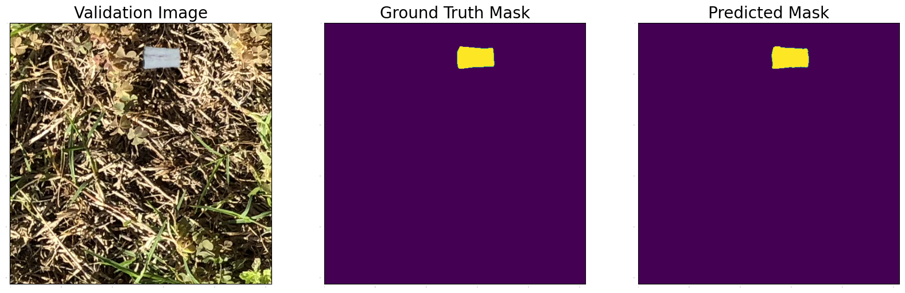

# Cigarette Butt Detection

This repository contains the code for detecting cigarette butts in images using TensorFlow.

## Download Data

You can download the cigarette butt dataset from the following link:

[https://www.immersivelimit.com/datasets/cigarette-butts](https://www.immersivelimit.com/datasets/cigarette-butts)

## Environment

To set up the required environment, you can use the following `tf_environment.yml` file:

```bash
conda env create -f tf_environment.yml
```

## Training Model
To train the model, you can use the training.py script. Here are the available parameters:

```bash
usage: training.py [-h] [--epochs EPOCHS] [--mirror MIRROR] [--save_ds SAVE_DS] [--batch BATCH]

Parameters for training model: number of epochs and access to several GPUs

optional arguments:
  -h, --help         show this help message and exit
  --epochs EPOCHS    The number of epoch for training
  --mirror MIRROR    if device has several GPUs then mirror strategy distributes training among it
  --save_ds SAVE_DS  save datasets after creating for speed up in next training
  --batch BATCH      the size of batch during training
```

You can adjust the values of these parameters according to your needs. For example, to train the model for 20 epochs with a batch size of 16 and using mirror strategy, you can use the following command:
```bash
python training.py --epochs 20 --batch 16 --mirror True
```
The training will choose the best model over all batches and save it in the models

## Demo
The more detailed demo could be found in the notebook demo.ipynb. There are three examples:




On the validation data, a dice score of 0.96 was achieved.

You can load the best model and use it in your own code using the following code:

```python
import tensorflow as tf

model = tf.keras.models.load_model('models/model_undet.h5')
# Use the model to make predictions on new images
```

## Ubuntu 22.04
Please note that TensorFlow currently only supports Ubuntu 20.04 and Ubuntu 18.04. If you are using Ubuntu 22.04, you may encounter issues with TensorFlow installation. In this case, you should do:

``` bash 
conda install -c nvidia cuda-nvcc=11.3.58

mkdir -p $CONDA_PREFIX/etc/conda/activate.d
printf 'export XLA_FLAGS=--xla_gpu_cuda_data_dir=$CONDA_PREFIX/lib/\n' >> $CONDA_PREFIX/etc/conda/activate.d/env_vars.sh
source $CONDA_PREFIX/etc/conda/activate.d/env_vars.sh

mkdir -p $CONDA_PREFIX/lib/nvvm/libdevice
cp $CONDA_PREFIX/lib/libdevice.10.bc $CONDA_PREFIX/lib/nvvm/libdevice/
This should resolve any installation issues with TensorFlow on Ubuntu 22.04.
```
